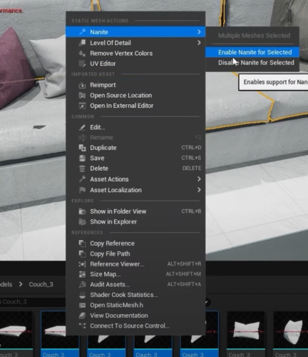
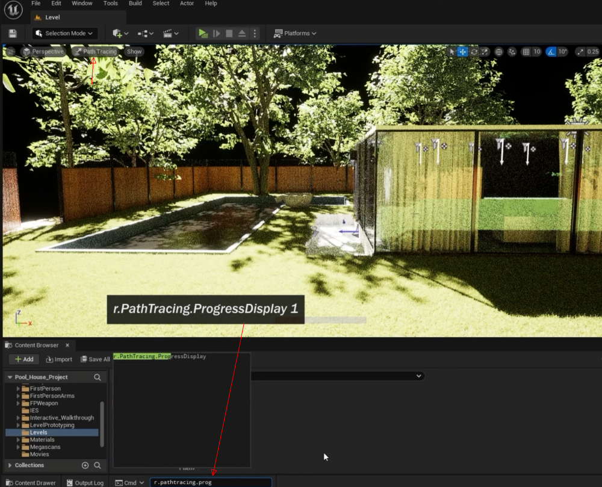
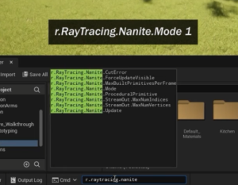
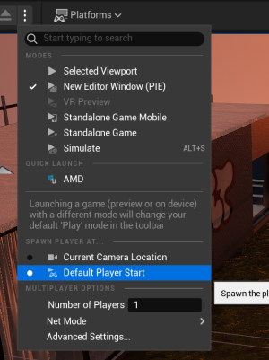

# Unreal Engine Quick Guide For Architects

## Introduction

I have attached some materials and FBXs to help reproduce parts of this guide more easily. However, please be aware that due to the incomplete migration of these items, there may be issues with importing them into your project. The import process might not be fully successful or could be partially incomplete.

From the guide, everything is reproducible except for animations and some FBX objects. These elements can be created or adjusted using Blender or other 3D design software.

The primary goal of this guide is to introduce users to basic functionalities, especially tailored for architects. For complete and detailed implementation, additional work with 3D modeling tools may be necessary.
  

## Useful Prerequisite Knowledge

### GPU Usage
- To check GPU usage, use the command `stat gpu` in the console.

### Setting the Pivot Point of an Object
1. Select the object.
2. Navigate to **Modeling Mode > XForms > Edit Pivot**.
3. Choose an option, e.g., Center.

### Changing Views and Object Selection
- Switch from Perspective to an orthographic view (e.g., front, top) to enable multi-object selection.  
  - **Select Multiple Objects:** Left-click and drag to draw a selection rectangle.
  - **Move the View:** Right-click and drag.
  - **Measure Distance:** Middle-click and drag.

### Basic Controls
- **Move the Camera:** Right-click + WSAD, QE for up and down.
- **Move with Selected Object:** Shift + Left-click and drag.
- **Focus on Selected Object:** Press `F`.
- **Gizmos:**
  - **Move:** Press `W`.
  - **Rotate:** Press `E`.
  - **Scale:** Press `R`.
- **Adjust Camera Speed:** Use the icon on the top right.
- **Hide Icons/Gizmos:** Press `G`.
- **Create a Copy of the selected:** Press `Ctrl + D`.
- **Open Content Browser:** Press `Ctrl + Space`.
- **Move a Copy of an Object:** Alt + Left-click on a move arrow and drag.
- **Snap Object to the Closest Face:** Press `End` (works only if the selected object isn't already touching another object).
- **Snap All Selected Objects to Nearest Face:** Alt + End.
- **Group Objects:** Press `Ctrl + G`.
- **Ungroup Objects:** Press `Shift + G`.

### Migrating All Assets From an Old Project

**Note:** The purpose of this operation is to retain only the items that are actively used in the project.

1. **Create a New Project:**
   - Select **Architecture > Blank**.
   - Give the project a name and choose a folder location.
   - Click **Create**.

2. **Delete Content in the Content Folder:**
   - Open the newly created project.
   - Delete everything in the **Content** folder. 
   - If deletion isn't possible, make a note of the contents and delete them after migration.

3. **Migrate Assets from the Old Project:**
   - Open the old project.
   - Right-click on the **Level** and choose **Asset Actions > Migrate**.
   - Review the selected items (all used assets will be checked; uncheck anything you don't want to migrate) and click **OK**.
   - Navigate to the **Content** folder of the new project and select it.

### Adding First Person Game Mode
**Note:** This is required for the Interactive Walkthrough and to activate certain animations.

1. **Add the First Person Content Pack:**
   - Click the **+Add** button in the Content Browser.
   - Select **Add Feature or Content Pack > First Person > Add to Project**.

2. **Set Up Game Mode:**
   - Go to the **Window** dropdown and select **World Settings**.
   - In the **GameMode** section, set **GameMode Override** to **BP_First_Person_Character**.

## Importing FBX Files into Unreal Engine

### Import Settings

When importing FBX files into Unreal Engine, you can customize the import settings to exclude features that are not needed:
- **Animation:** Uncheck this if you do not want to import animations.
- **Collision:** Uncheck this if collision meshes are not required.

### Common Causes of Issues with Missing Faces

### Flipped Normals
- **Issue:** Normals oriented inward rather than outward cause Unreal Engine to not render these faces, making them appear missing.
- **Solution:**
  1. **In Blender:**
     - Enable the "Face Orientation" overlay to check the direction of the normals.
     - Normals facing inward are shown in red; flip them to blue (outward) before exporting.
     - Press `Alt + N` and select "Flip" to correct any inverted normals.

### Backface Culling
- **Issue:** Unreal Engine uses backface culling, which does not render faces that are not visible from the camera’s perspective. Flipped normals can cause these faces to be culled.
- **Solution:** Ensure all normals are facing the correct direction by checking them in Blender.

### Geometry Issues
- **Issue:** Overlapping vertices, non-manifold edges, or other geometry problems can cause import issues.
- **Solution:**
  1. **In Blender:**
     - Use `Mesh > Clean Up > Merge by Distance` to merge overlapping vertices.
     - Use `Mesh > Clean Up > Delete Loose` to remove unnecessary geometry.

### Modifiers Not Applied
- **Issue:** Modifiers (like Subdivision Surface) not applied can lead to unexpected results in Unreal Engine.
- **Solution:**
  1. **In Blender:**
     - Apply all modifiers before exporting the FBX.
     - Check the "Apply Modifiers" option during export.

### Fixing Black FBX Imports in Blender

### Check and Flip Normals
1. **In Blender:**
   - Select the mesh in Object Mode.
   - Switch to Edit Mode and select all faces (`A`).
   - Press `Alt + N` and choose "Flip" to correct any inverted normals.

### Apply Modifiers
1. **In Blender:**
   - Ensure all modifiers are applied before exporting.
   - Check the "Apply Modifiers" option during export.

### Export Settings
1. **In Blender:**
   - Check the "Apply Modifiers" option.
   - Enable "Triangulate" if necessary, as Unreal Engine converts quads to tris on import.

### Reimport and Check UV Map
1. **In Blender:**
   - Reimport the FBX to check for any discrepancies.
   - Ensure the UV map is properly unwrapped and aligned with the texture.
   - Redo UV unwrapping if necessary before re-exporting.

## Accessing and Manipulating Variables Across Blueprints

### Step 1: Create the Variable in Blueprint A

1. **Open Blueprint A:**
   - Navigate to Blueprint A in the Content Browser and double-click to open it.

2. **Create the Variable:**
   - In the `My Blueprint` panel, click the **+ Variable** button.
   - Name the variable `tt`.
   - Set the variable type (e.g., Integer, Float, Boolean, etc.) as needed.

3. **Make the Variable Public:**
   - Select the `tt` variable in the `My Blueprint` panel.
   - In the `Details` panel, check the **Instance Editable** box.
   - Optionally, check the **Expose on Spawn** option if you want the variable to be accessible when the Blueprint is spawned.

### Step 2: Create a Reference to Blueprint A in Blueprint B

1. **Open Blueprint B:**
   - Navigate to Blueprint B in the Content Browser and double-click to open it.

2. **Create a Variable of Type Blueprint A:**
   - In the `My Blueprint` panel, create a new variable.
   - Name this variable `BlueprintAReference`.
   - Set its type to `BlueprintA` (the class of your first Blueprint).

### Step 3: Assign the Reference in Blueprint B

You can assign the reference to Blueprint A either through the level or dynamically.

### Option A: Assign via the Details Panel

1. **Place an Instance of Blueprint A in the Level:**
   - Drag and drop an instance of Blueprint A into your level from the Content Browser.

2. **Select the Instance of Blueprint B:**
   - In the level, select the instance of Blueprint B.

3. **Assign the Reference:**
   - In the Details Panel of the Blueprint B instance, find the `BlueprintAReference` variable.
   - Select the instance of Blueprint A you placed in the level.

### Option B: Assign Dynamically Using Get All Actors of Class

1. **Open the Event Graph of Blueprint B:**
   - Go to the Event Graph in Blueprint B.

2. **Add the Get All Actors of Class Node:**
   - Right-click in the Event Graph to bring up the context menu.
   - Search for and add the **Get All Actors of Class** node.
   - Set the class to `BlueprintA`.

3. **Get the First Actor:**
   - Drag off the **Out Actors** pin and use the **Get (0)** node to get the first instance of Blueprint A.

4. **Assign to the Variable:**
   - Drag off the output pin of the **Get (0)** node and connect it to a **Set** node for your `BlueprintAReference` variable.

#### Example Blueprint Setup for Dynamic Assignment

```plaintext
Event BeginPlay
    └── Get All Actors of Class (Class: BlueprintA)
        └── Get (0)  // Get the first BlueprintA instance
            └── Set BlueprintAReference
```
### Step 4: Get and Set the Variable `tt` in Blueprint B

Once you have the reference to Blueprint A in Blueprint B, you can access and modify the `tt` variable.

### Get the Variable

1. **Drag off the `BlueprintAReference` Variable:**
   - In the Event Graph of Blueprint B, drag off the `BlueprintAReference` variable node.

2. **Search for and Add the `Get tt` Node:**
   - Search for **Get tt** in the context menu that appears.
   - Add the **Get tt** node to access the current value of `tt`.

### Set the Variable

1. **Drag off the `BlueprintAReference` Variable Again:**
   - Drag off the `BlueprintAReference` variable node once more.

2. **Search for and Add the `Set tt` Node:**
   - Search for **Set tt** in the context menu.
   - Add the **Set tt** node to modify the value of `tt`.

3. **Connect the New Value:**
   - Connect the input pin of the **Set tt** node to the new value you want to assign to `tt`.

#### Example Blueprint Setup for Getting and Setting `tt`

```plaintext
Event BeginPlay
    └── Get All Actors of Class (Class: BlueprintA)
        └── Get (0)  // Get the first BlueprintA instance
            └── Set BlueprintAReference

// Later in the Event Graph
Some Event (e.g., On Button Press)
    ├── Get BlueprintAReference
    ├── Get tt  // Get the current value of tt
    └── Set tt  // Set a new value for tt
        └── Value (e.g., Integer Value 42)
```


## Materials
### Basics
#### Using Materials from Another Project
1. Locate the material: Click on the object > **Details > Materials** (folder icon with magnifying glass).
2. Right-click on the material > **Asset Action > Migrate** > OK.
3. Select the destination folder of the project to migrate the material.

#### Creating a Material from a JPG

  1. Right-click on the JPG file.
  2. Select **Create Material**.

#### Constant3Vector
- **Purpose:** Defines color with R, G, B values.

### Creating Parameters from Material Nodes
- **To create a parameter:** Right-click on the connection points of the Result node > **Promote to Parameter**.
- **Note:** Adjusting the contrast of a texture can significantly change its appearance.

#### Real-Time Parameter Changes
1. Convert the desired node (e.g., color) to a parameter by right-clicking the node > **Convert to Parameter**.
2. Apply the changes.
3. Create a material instance: Right-click on the material > **Create Material Instance**.
4. Apply the material instance to the object.
5. **To change the color in real-time:**
   - Double-click the material instance.
   - Check the box for the color parameter you created and adjust as needed.

#### Roughness and Specular Range
- The range for roughness and specular is from `0` to `1`.

#### Preparing Imported Material Textures
- **General Requirement:** 3 files—Texture, Normal, Roughness.
- **sRGB Settings:**
  - **Texture:** Enable sRGB. (Double-click the texture > Details > Enable sRGB).
  - **Normal Map:** Disable sRGB and set Compression Settings to Normalmap (DXT 5, etc.).
  - **Roughness:** Disable sRGB and set Compression Settings to Masks (no sRGB).

#### Applying Texture to a Color
1. Create a new color.
2. Double-click it to open the editor.
3. Drag and drop the three texture components into the editor.
4. Select the main texture.
5. **Set Material Expression Texture Base:**
   - **Sample Type:** Set to Virtual Color or Virtual Linear Color.
6. **For Mask and Roughness:** Use Virtual Mask and Virtual Roughness.

#### Scaling a Texture
1. Create a **Texture Coordinate**, a **Multiply** node (`M + Left Click`), and a **Constant** node (`1 + Left Click`).
2. Connect the **Multiply** node to the other two nodes' `A` and `B` inputs.
3. Connect the multiplier node to all textures' UV points.
4. Apply the changes. Adjusting the Constant value will now scale the texture.

#### Controlling Texture Intensity
1. Create a **Multiply** node (use **Flatten Normals** for normal maps) and a **Constant** node.
2. Connect the RGB output to the **Multiply** node's `A` input and the **Constant** node to the `B` input.
3. Connect the **Multiply** node to the color's corresponding input points.
4. Optionally, create parameters from these Constant nodes.

#### Adjusting Parameter Range
1. Double-click the material.
2. In the details under the sphere, set the slider's maximum to `1`.
3. Apply the changes.

#### Controlling Tint
1. Create a **Multiply** node and a **Constant3Vector** (`3 + Left Click`).
2. Connect the **Constant3Vector** to the `A` input and the RGB path's last point to the `B` input. (This could be from a texture, another Multiply node, or another node).
3. Connect the **Multiply** node to the **Base Color**.
4. Convert the node to a parameter (e.g., `Tint`).
5. Apply the changes (always click "Apply" to ensure they take effect).

### Some Useful Materials

#### Curtain Translucent Material

- **Blend Mode:** Translucent.
- **Translucency / Lighting Mode:** Surface ForwardShading.
- **If Refraction is Disabled:**
  - Set **Refraction Method** to **Index of Refraction**.
  - Set **Translucency / Lighting Mode** to **SurfaceTranslucencyVolume**.
- **Two-Sided:** Checked.

**Note:** If a curtain material has high transparency or is set to a translucent blend mode, it might not register for selection.
  - Open the material editor for the curtain's material and check the **Opacity** settings.
  - Ensure the material isn't overly transparent or masked in a way that makes it unselectable.

#### Glass Material for Lumen

1. **Blend Mode:** Translucent.
2. **Translucency / Lighting Mode:** Surface ForwardShading.
3. **If Refraction is Disabled:**
   - Set **Refraction Method** to **Index of Refraction**.
   - Set **Translucency / Lighting Mode** to **SurfaceTranslucencyVolume**.
4. **Two-Sided:** Checked.
5. **Add Nodes and Convert to Parameters:**
   - **Base Color**
   - **Metallic**
   - **Specular**
   - **Roughness**
   - **Opacity**
6. **Add a Lerp Node:** (`L + Left Click`), two Constant nodes, and a Fresnel node.
   - Connect a Constant (value: 1) to `A`, another Constant (parameter: `IndexOfReflection`, value: 0) to `B`, and the Fresnel node to the alpha of the Lerp node.
   - Connect the Lerp node to Refraction.
7. Apply the changes.
8. **Create Material Instance:**
   - **IndexOfReflection:** 1
   - **Metallic:** 0.1
   - **Opacity:** 0.5
   - **Roughness:** 0.01
   - **Specular:** 0.5

#### Glass Material for Path Tracing

1. **Blend Mode:** Translucent.
2. **Translucency / Lighting Mode:** Surface ForwardShading.
3. **If Refraction is Disabled:**
   - Set **Refraction Method** to **Index of Refraction**.
   - Set **Translucency / Lighting Mode** to **SurfaceTranslucencyVolume**.
4. **Two-Sided:** Checked.
5. **Add Nodes and Convert to Parameters:**
   - **Base Color**
   - **Metallic**
   - **Specular**
   - **Roughness**
   - **Opacity**
   - **Refraction**
6. Apply the changes.
7. **Create Material Instance:**
   - **IndexOfReflection:** 1
   - **Metallic:** 1
   - **Opacity:** 0.2
   - **Roughness:** 0
   - **Specular:** 1
   - **Base Color:** R: 0, G: 0.232, B: 0.324, B: 0.406

## Lights

- **Movable Lights:** These lights have dynamic shadows.

### Important Note:
- If night or morning sky shines through planes:
  - In the plane's details, enable **Use Two Sided Lighting** and **Shadow Two Sided**.
  - If still not acceptable, block the sun with a cube scaled accordingly in front of the plane.

## 3D Models

- **Source for 3D Models:** Visit [cgtrader.com](https://cgtrader.com) for a wide selection of 3D models.

### Splitting Objects

  1. Go to **Modeling Mode > Transform > Split**.
  2. **New Asset Location:** Choose the current folder.
  3. **Search for the Folder:** Locate the folder where the original combined meshes are stored by clicking on the folder icon with a magnifier.

### Collision

- **To Remove Collision:**
  1. Double-click on the static meshes.
  2. Go to the **Collision** dropdown.
  3. Select **Remove Collision**.

- **To Create Custom Collision Boxes:**
  1. Go to **Add > Blocking Volume**.

## Animations

### Importing an ABC File

  1. Click on **Import** in the Content Browser window.
  2. Select the ABC file and click **Open**.
  3. **Import Type:** Choose **Geometry Cache**.
  4. **Force One Smoothing Group Per Object:** Ensure this is checked.
  5. **Recompute Normals:** Ensure this is checked.
  6. **Scale:** Set to `100, 100, 100`.
  7. **Rotation (Blender):** Typically set to `-90, 0, 180` or leave it as is and adjust later.


### Sliding Doors Setup

#### Creating a Blueprint for the Door

1. **Select the Object:**
   - In the Content Drawer, select the object that will be used as the sliding door.

2. **Convert to Blueprint Class:**
   - Click the **Blueprint** icon.
   - Choose **Convert Selection to Blueprint Class**.
   - Ensure **Harvest Components** is selected.
   - Choose a folder, give it a name, and click **Select**.

3. **Add a Box Collider:**
   - In the **Viewport** of the Blueprint, click **+Add** and select **Box Collider**.
   - Adjust and set the collider's position and size as needed.
   

4. **Set Up Node Connections:**
   - With the box collider selected, create the necessary nodes and connections for the sliding door's movement.
   - **Explode the Set Relative Location Node:** Right-click on the node and break it down to access individual coordinate values.
   
   - **Timeline Node Details:**
     - Add a **Float Track** to the timeline.
     - Insert keyframes and adjust them. Right-click on each keyframe and choose **Auto** for key interpolation.
     

### Curtain Animation Triggered by Door Opening

1. **Open the Door's Blueprint:**
   - Open the Blueprint you created for the sliding door.

2. **Add Curtain Animation:**
   - Click **+Add** and select **GeometryCache** component.
   - Drag and drop the **GeometryCache** component into the EventGraph.

3. **Set Up Animation Sequence:**
   - Add a **Sequence** node and a **Play from Start** node to control the curtain animation.
   - Remove the **On Component End Overlap** path.

4. **Configure Curtain Animation:**
   - In the **Viewport**, select the **GeometryCache** component.
   - In the Details panel, under **GeometryCache**, select the appropriate **GeometryCache (Curtain)** asset.
   - Adjust the curtain's position in the viewport to align with the door.

5. **Disable Auto-Run and Looping:**
   - In the curtain animation settings, uncheck the **Running** and **Loop** options to ensure the animation only plays when the door is opened.

## Foliage

- **Note**: Megascan 3D Tree libraries and Geometry/Pivotpainter objects can be added to the foliage tab for painting on surfaces.

### Adjusting Foliage Settings

1. **Scale Adjustment**: Adjust the `Scale Min` and `Max` to apply random scaling when placing objects on surfaces.
2. **Paint Density**: Set how dense the paint will be.
3. **Z Offset**: Adjust the vertical height of the object placement.
4. **Optimizing Scene Rendering**: If frame rates drop, consider the following:

### Option A: Disabling Advanced Wind Node

1. **Navigate to Geometry/Pivotpainter Folder**: Open any tree, then open `Element0` material, its parent, and disconnect the `Advanced Wind` node.  

2. **Apply Changes**: Implement these changes.

### Shadow Issues and Grass Patches

1. **Console Command**: Use the appropriate command to toggle the setting (`0` to disable, `1` to enable) for resolving shadow issues.  

2. **Grass Patches Fix**:
- To avoid empty patches in the grass, disable `Nanite` for grass static meshes and set `LOD` to 1.  

- Further improvement if necessary e.g.  
Open MI_Grass_Clumps_rbojr_2K (first in the folder) and change `Opacity Max Clip Value` to 0.1.  
 

- **Note**: LOD settings can be copied from one mesh to others. Right-click the mesh LOD to copy and paste.

## Nanite

### Enabling Nanite

1. **Enable Nanite for Meshes**: Go to the mesh properties or select all static meshes in the viewport, press `Ctrl + B` to search them in the Content Drawer, then right-click and select `Nanite > Enable Nanite For Selected`. 


2. **View Nanite Visualization**: Use `View Mode > Nanite Visualization > Clusters` to view Nanite.  


### Nanite Details

- **Functionality**: Nanite adjusts the number of polygons in a mesh based on viewing distance.
- **Removing Artifacts**: Uncheck `Project Settings > Engine > Rendering > Hardware Ray Tracing > Ray Traced Shadows`  
  
- **Note**: Nanite doesn't work with deforming meshes, skeletal meshes, or geometry cache animations. Avoid using it with meshes that have translucent materials.
- **Compatibility**: Nanite works with materials that have blend mode masks and is compatible with foliage as of 2024.

### Preserving Grass and Trees

1. **Prevent Disappearance**: In the grass (or tree) mesh details, ensure `Preserve Area` is checked.  
 

## Level of Detail (LOD)

### Applying LOD to Static Meshes

1. **Disable Nanite**: Go to the mesh details and disable Nanite if it's enabled.
2. **Adjust LOD Settings**: Set the `LOD Group` to `LargeProp`.  

   - **Note**: LOD creates different levels for various distances. Adjust these as needed.
3. **Custom LOD Controls**: Check `Custom` for more detailed control over LODs.  

   - **Adjust Triangle Percentage**: Use this to change the level of detail.  
   

### Adjusting LOD Distance

1. **Disable Auto Compute**: Uncheck `Auto Compute LOD Distance`.  

2. **Set Screen Size**: Input the desired screen size value to adjust the LOD.  


- **Note**: If the distance value for LOD1 is greater than LOD2, LOD0 will skip directly to LOD2!

### Copying LOD Settings

1. **Copy LOD from Another Mesh**: Select the mesh you want to copy LOD from in the Content Browser.
2. **Paste LOD to Other Meshes**: Right-click the target meshes and select `Level Of Detail > Paste LOD`.  
 


## IES Light Texture

### Steps to Apply IES Light Texture:
1. **Download and Import IES Texture:**
   - Find and download an IES texture file.
   - Import the IES texture into your Unreal project folder.

2. **Place a Point Light:**
   - Add a Point Light or Spot Light to your scene.

3. **Apply the IES Texture:**
   - Select the Point Light in your scene.
   - In the **Details** panel, find the **Light Profiles** section.
   - Drag and drop the imported IES texture into the **IES Texture** slot.

4. **Adjust Settings:**
   - Adjust the light's angle, position, and scale as needed.
   - Optionally, place a lamp static mesh around the light source for a more realistic effect.

## Decals

### Steps to Apply Decals:
1. **Download Decal:**
   - Download a decal texture, e.g., from the Megascan library.

2. **Place Decal in Scene:**
   - Add the decal material instance to your scene by dragging it onto a surface.
   - Adjust the decal’s position, scale, and rotation to fit your scene.

## Lumen

### Enable/Disable Lumen:
1. **Enable Lumen for Global Illumination:**
   - Go to **Settings > Project Settings > Engine > Rendering > Global Illumination**.
   - From the dropdown, select **Lumen**.

2. **Enable Lumen for Reflections:**
   - In **Settings > Project Settings > Engine > Rendering > Reflections**, set **Reflection Method** to **Lumen**.

### Additional Notes on Lumen:
- **Diffuse Indirect Lighting:** Surfaces reflect their colors onto other surfaces.
- **Adjust Indirect Lighting Intensity:** 
  - In the **SunSky** settings, under **Directional Light Details**, you can change the **Indirect Lighting Intensity** to control how much light is bounced off surfaces.

### Lumen Global Illumination Settings

### Lumen Scene Lighting Quality
- **Value:** 1.0  
  Adjusts the quality of Lumen's global illumination. Higher values result in better lighting quality at the expense of performance.

### Lumen Scene Detail
- **Value:** 1.0  
  Controls the amount of detail in the scene that Lumen considers. Higher values result in more detailed global illumination calculations and more detailed reflection on surfaces.  
  **Note:** Value higher around 4 increases the reflection of smaller objects.

### Lumen Scene View Distance
- **Value:** 20,000.0  
  Determines the distance at which Lumen will trace and calculate global illumination. Higher values allow for longer-distance light bounces.

### Final Gather Quality
- **Value:** 1.0  
  This adjusts the quality of the final gather in Lumen. A higher value improves the accuracy and smoothness of indirect lighting.  
  **Note:** Practically reduces the weird flickering on different surfaces/objects.

### Screen Traces
- **Checkbox:** Checked (enabled)  
  When enabled, Lumen will use screen-space traces to gather additional lighting information, improving the quality of reflections and shadows close to the camera.

### Max Trace Distance
- **Value:** 20,000.0  
  This setting defines the maximum distance for Lumen to trace for indirect lighting. A larger value can help in larger scenes but may reduce performance.

### Scene Capture Cache Resolution Scale
- **Value:** 1.0  
  This controls the resolution scale of the scene capture cache used by Lumen. Increasing the resolution can improve the detail and accuracy of the global illumination at the cost of performance.

### Advanced Lumen Global Illumination Settings

### Lumen Scene Lighting Update Speed
- **Value:** 1.0  
  This parameter controls how quickly Lumen updates the lighting in the scene. Faster updates can make dynamic changes more responsive but may impact performance.

### Final Gather Lighting Update Speed
- **Value:** 1.0  
  Similar to the above, this setting adjusts the update speed for the final gather, affecting how quickly it responds to changes in lighting.

### Diffuse Color Boost
- **Value:** 1.0  
  Multiplies the diffuse lighting color, allowing you to boost or reduce the intensity of diffuse lighting without altering the overall scene lighting.

### Skylight Leaking
- **Value:** 0.0  
  Controls the amount of skylight leaking through objects. A value of 0 means no leaking, while higher values allow some light to pass through occlusions.  
  **Note:** Avoid pitch dark inside closed objects, rooms, etc.

### Full Skylight Leaking Distance
- **Value:** 1,000.0  
  Sets the distance over which full skylight leaking occurs. This is relevant if Skylight Leaking is enabled.

### Lumen Reflections Settings

### Method
- **Value:** Lumen  
  Specifies the reflection method being used. Here, Lumen is chosen, which leverages its global illumination system for reflections.

### Quality
- **Value:** 1.0  
  Determines the quality of Lumen reflections. A higher value yields better reflection quality but at a performance cost.

### Ray Lighting Mode
- **Value:** Project Default  
  Controls the method used for ray lighting in reflections. The "Project Default" means it adheres to the settings configured at the project level.

### Screen Traces
- **Checkbox:** Checked (enabled)  
  When enabled, Lumen will use screen-space reflections, enhancing the quality of reflections by leveraging information already visible on the screen.

### High-Quality Translucency Reflections
- **Checkbox:** Unchecked (disabled)  
  When enabled, this option increases the quality of reflections on translucent surfaces, at the cost of performance.  
  **Note:** Provides much better reflections.

### Max Roughness to Trace
- **Value:** 0.4  
  Determines the maximum roughness value for which Lumen will trace reflections. Lower values mean reflections will be sharper, while higher values allow for blurrier reflections.

### Max Reflection Bounces
- **Value:** 1  
  Sets the number of bounces a reflection can make. More bounces can create more realistic reflections but will be more performance-intensive.

### Max Refraction Bounces
- **Value:** 0  
  Determines the number of times light can refract through materials. A value of 0 means no refraction bounces, which can be useful for certain materials to save on performance.

**Note:** Value / Checkbox represents the default value.

## Path Tracing

To enable or disable path tracing, follow these steps:

### Enabling Path Tracing

1. **Set Default RHI:**
   - Navigate to: `Settings > Project Settings > Platforms > Windows > Target RHIs`
   - Set `Default RHI` to `DirectX12`.

2. **Enable Hardware Ray Tracing:**
   - Navigate to: `Settings > Project Settings > Engine > Rendering > Hardware Ray Tracing`
   - Ensure `Support Hardware Ray Tracing` is checked.
   - Ensure `Path Tracing` is checked.

### Viewing Path Tracing Progress

- To view the scene in path tracing mode, you will see a progress bar indicating the rendering progress.  


**Note:** Path tracing does not support movements, animated elements, or dynamic effects such as water waves.

### Path Tracing Settings

### Max Bounces
- **Value:** 32
- **Description:** This setting controls the maximum number of light bounces the path tracer will calculate. More bounces result in more realistic lighting as light reflects and refracts through more surfaces before being absorbed. However, increasing this value significantly impacts rendering time.
- **Note:** An ideal value in general cases is approximately 8.

### Samples Per Pixel
- **Value:** 512
- **Description:** This parameter determines the number of samples taken per pixel. Higher values result in less noise and more accurate lighting but increase render times. More samples provide a smoother, more refined final image.

### Filter Width
- **Value:** 3.0
- **Description:** This setting controls the width of the reconstruction filter applied to the image. A larger filter width helps reduce noise by averaging more samples together but can blur fine details. The value here balances noise reduction with detail preservation.

### Emissive Materials
- **Checkbox:** Checked (enabled)
- **Description:** When enabled, emissive materials in the scene act as light sources in the path tracing calculation. This is important for scenes with objects or surfaces that emit light contributing to overall illumination.

### Max Path Exposure
- **Value:** 30.0
- **Description:** This controls the maximum exposure level for paths traced in the scene, limiting how bright the paths can get. It helps prevent overly bright spots in the final render.

### Reference Depth of Field
- **Checkbox:** Unchecked (disabled)
- **Description:** When enabled, this setting allows the path tracer to reference the scene's depth of field settings, creating realistic depth-of-field effects. With it unchecked, depth of field is not considered in the path tracing process.
- **Note:** It is generally better to enable this setting.

### Reference Atmosphere
- **Checkbox:** Unchecked (disabled)
- **Description:** This setting determines whether the path tracer considers atmospheric effects (e.g., fog, haze, or other volumetric effects) during rendering. When disabled, atmospheric effects will not influence the path tracing calculation.

### Denoiser
- **Checkbox:** Checked (enabled)
- **Description:** The denoiser reduces noise in the final image by smoothing out high-frequency noise patterns from path tracing. This results in cleaner images with fewer samples, speeding up render times while maintaining visual quality.
- **Notes:**
  - It is often better to increase the Samples Per Pixel instead of relying on the denoiser because the denoiser can remove pixels, resulting in loss of information.
  - The denoiser can introduce flickering in animations due to its frame-by-frame basis, which removes different noise patterns from different frames.

**Note:** Values and checkboxes represent the default settings.

### Enabling Path Tracing for Nanite


### Addressing Missing Details

- If you notice missing details such as tree leaves or other object details, adjusting the `Fallback Relative Error` as described below helps ensure that the object displays more accurately in Path Tracing.

1. **Open the Object:**
   - Double-click on the object in the Content Drawer to open its settings.

2. **Adjust Nanite Settings:**
   - Go to `Nanite Settings`.
   - Set `Fallback Relative Error` to `0.0`.
   - Click `Apply` to save the changes.  
   

### Material Considerations

- **Base Color and Albedo:**
  - **Recommendation:** Keep the Base Color and Albedo value at 0.8 or less.
  - **Reason:** Materials with these values are not reflecting 100% of the light, which can affect the appearance of the object under Path Tracing.

**Note:** Adjusting these settings helps maintain the integrity of the visual details and ensures accurate rendering in Path Tracing.

## Working with Cameras and Sequences

### Adding and Configuring a Camera

1. **Add a Camera to the Scene:**
   - Open the hamburger menu on the top left.
   - Select `Create Camera Here` > `Cine Camera Actor`.

2. **Move and View Through the Camera:**
   - Right-click on the Camera Actor.
   - Select `Pilot` to move and see through the camera.

3. **Camera Details:**
   - **Filmback:** Main camera settings.
   - **Focus:** Use the Picker to select the area to focus on. Use the plane to see where the focus is.  
   
   - **Current Focal Length:** Controls how much of the scene is visible. Approximate values: 25-35 for interiors.
   - **Current Aperture:** Affects the blur in out-of-focus areas. Adjust to avoid losing exposure.  
   

### Steps to Animate a Camera

1. **Create a Level Sequence:**
   - Right-click in the Content Browser and select `Cinematics > Level Sequence`.
   - Name your sequence appropriately.
   - Double-click the new Level Sequence to open it.

2. **Add a Camera to the Sequence:**
   - In the Level Sequence window, click `Add Track` and select `Cine Camera Actor`.
   - Alternatively, drag a `CineCameraActor` from the Place Actors (Outliner) panel into your scene.

3. **Set Up the Camera:**
   - Select the camera in the scene and adjust its properties in the Details panel (e.g., Focal Length, Aperture).
   - Position the camera as desired in your scene.

4. **Animate the Camera:**
   - With the Level Sequence open, click on the camera track you added.
   - Move the timeline cursor to the desired frame for a keyframe.
   - Adjust the camera's Transform (Location, Rotation) in the Details panel.
   - Click the `Add Key` button (or the key icon next to the Transform properties) to create a keyframe.

5. **Add More Keyframes:**
   - Move the timeline cursor to a new frame, adjust the camera's Transform, and add keyframes.
   - Create complex animations by adding multiple keyframes at different points.

6. **Preview the Animation:**
   - Press the Play button in the Sequencer to preview your camera animation.
   - Adjust keyframes or properties as needed.

7. **Finalize and Export:**
   - Once satisfied with your animation, export it as a video or integrate it into your game.
   - Go to `File > Export > Render this Movie` and follow the prompts to save your cinematic sequence.

### Additional Tips

- **Camera Cuts:** Use Camera Cuts to switch between multiple cameras during the animation.
- **Linear Interpolation:** Select keyframes and check `Linear` for smooth transitions.
- **Rotate Camera Around Objects:**
  - Place a `Basic Actor` at the center of the object you want the camera to rotate around.
  - Create a `Camera Actor` and place it under the `Basic Actor` (Parent: Basic Actor, Child: Camera Actor).
  - Create a Level Sequencer.
  - Drop the `Basic Actor` into the Level Sequencer.
  - Keyframe `Yaw: 0` and `Yaw: 360` (Full circle) for rotation.

### Adding Camera Shake

1. **Create a Camera Shake Blueprint:**
   - Open the Content Browser.
   - Right-click and select `Blueprint Class`.
   - Search for `Camera Shake` (or `MatineeCameraShake` for older versions).
   - Name your blueprint (e.g., `BP_CameraShake`).
   - Open the blueprint and configure the shake settings:
     - **Oscillation Duration:** Set to a high value or 0 for indefinite shaking.
     - **Blend In/Out Time:** Adjust how quickly the shake starts and stops.
     - **Amplitude:** Set values for Location and Rotation to define shake intensity.

2. **Add Camera Shake to the Level Sequence:**
   - Open the Level Sequence where you want the camera shake.
   - Select the camera in the Sequencer.
   - Click `Add Track` and choose `Camera Shake`.
   - Select the camera shake blueprint you created.

3. **Configure the Camera Shake Track:**
   - **Shake Duration:** Set in the Camera Shake blueprint or stretch the track in Sequencer.
   - **Adjust Keyframes:** Add keyframes if needed to control when the shake starts and stops.

4. **Preview and Adjust:**
   - Click `Play` in the Sequencer to preview the camera shake.
   - Adjust settings in the Camera Shake blueprint if necessary.

5. **Save and Finalize:**
   - Save your Level Sequence and Camera Shake blueprint.
   - Use this setup in your game or cinematic.

## Rendering the Scene

1. **Open Movie Render Queue:**
   - In the Sequencer, click the Render icon.
   - Click on the 3 dots and select `Movie Render Queue`.

2. **Add Level Sequence to Queue:**
   - Click `+ Render` to add your Level Sequence.

3. **Set Output Settings:**
   - Click `Unsaved Config` to configure render settings.
   - Click `+ Settings` to add and adjust settings (e.g., output format, resolution).
   - Set desired frame range. For still images, set the end frame to 1.  
   
   - Enable anti-aliasing and adjust sample counts for high-quality renders:
     - **Spatial Sample Count:** 4-64 (e.g., 512 samples for path tracing)
     - **Temporal Sample Count:** 4-64
     - **Override Anti-Aliasing:** Checked  
     

4. **Enable Path Tracing (Optional):**
   - Click `+ Settings` and choose `Path Tracer` if needed.

5. **Start Rendering:**
   - Ensure Interactive Walkthrough Menu is not active (disconnect Event nodes).  
   
   - Disable Physics from objects if necessary.
   - Check the running option for animation renders.
   - Click `Render Local` to start rendering.
   - Monitor progress in the Movie Render Queue window.

6. **Post-Processing:**
   - Enhance your render with lighting and post-processing effects.
   - Adjust console variables for better results (e.g., shadow quality, ambient occlusion).

7. **In Case of Crashes:**
   - Close background applications.
   - Lower texture resolution.
   - Optimize rendering by removing some foliage or objects.
   - Try Path Tracing if needed.

**Note:** The image sequence can be rendered to a movie file using tools like Adobe Premiere or DaVinci Resolve.

## Packaging the Project

To successfully package your Unreal Engine project, follow these steps to ensure all required components are installed and project settings are configured correctly.

### Install Required Components

1. **Windows SDK:**
   - Install the Windows Software Development Kit (SDK) appropriate for your version of Unreal Engine.

2. **.NET Core:**
   - For Unreal Engine 5.0 - 5.3: Install .NET Core 3.1.
   - For Unreal Engine 5.4 and later: Install .NET 6.

3. **Visual Studio:**
   - Download and install Visual Studio with the following components:
     - **Desktop development with C++**
     - **Game development with C++**
     - **.NET desktop development**  
     

### Configure Project Settings

1. **Blueprints for Play:**
   - Ensure that all Blueprints are configured for Play rather than Render. Rearrange and reconnect nodes if necessary to ensure they function correctly during gameplay.

2. **Object Settings:**
   - Verify that object settings such as simulation running are unchecked if they are controlled from the menu or otherwise.

3. **Set Default Game Map:**
   - Go to **Settings > Project Settings > Project > Maps & Modes**.
   - Set the **Game Default Map** to your desired Level.

4. **Force Update Device:**
   - Navigate to **Platforms > Windows > AMD**.
   - Enable **Force Update Device** if required.  
   

### Additional Steps

1. **Restart Unreal Engine:**
   - Restart Unreal Engine if required to apply changes and ensure all settings are properly updated.

2. **Add Player Start Actor:**
   - Ensure there is a **Player Start** actor placed in the scene.  
   

3. **Set Default Player Start:**
   - Confirm that **Spawn Player** is set to **Default Player Start**.  
   

### Package the Project

1. **Package the Project:**
   - Go to **Platforms > Windows > Package Project**.  
   

   Ensure you have selected the appropriate build configuration (e.g., Development, Shipping) and any additional packaging options required for your project.
